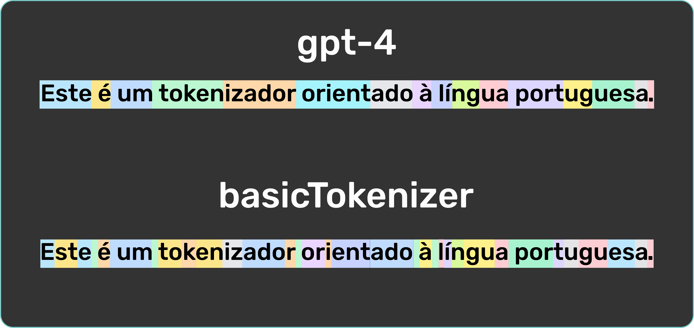

# Basic BPE Tokenizer

A simple yet effective Byte Pair Encoding (BPE) tokenizer implemented in Python. Designed for educational purposes and experimental tokenization of text data.

---

## 📊 Tokenizer Comparison

Visual comparison between GPT-4 tokenization and my custom `basicTokenizer`:

> The tokenization is only as good as the data.

---

## 🔧 Features

- Custom BPE tokenizer logic (no external libraries)
- Configurable number of merge steps
- Merge constraints (punctuation, whitespace, digit-letter boundaries, etc.)
- Vocabulary and merge history exportable to JSON
- Visualization script included

---

## 📝 Notes

- Merge logic includes smart constraints: avoids merging whitespace, punctuation, digit-letter boundaries, and more.
- Output is structured for inspection and further analysis.
- Focus is on clarity and control, not performance.

---

## 💡 Future Ideas

- Integration with NLP pipelines (e.g., preprocessing stages, language models)
- CLI or web-based demo interface

---

## 📚 References & Learning Resources

- [Byte Pair Encoding (BPE) Paper](https://arxiv.org/abs/1508.07909)
- [Andrej Karpathy’s NLP YouTube Series](https://www.youtube.com/@AndrejKarpathyYouTube)
- [Hugging Face Tokenizers GitHub](https://github.com/huggingface/tokenizers)